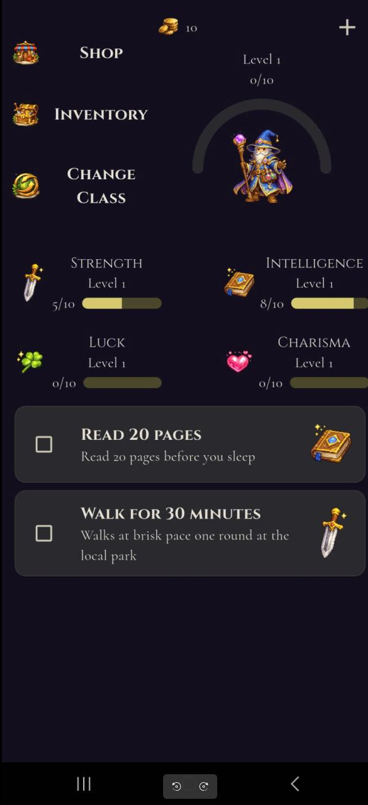
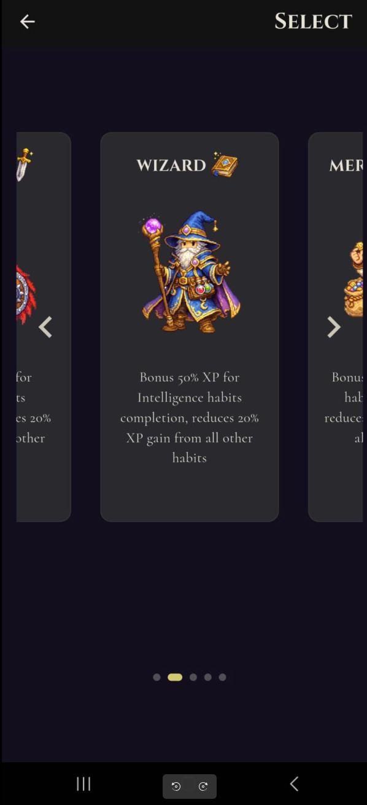
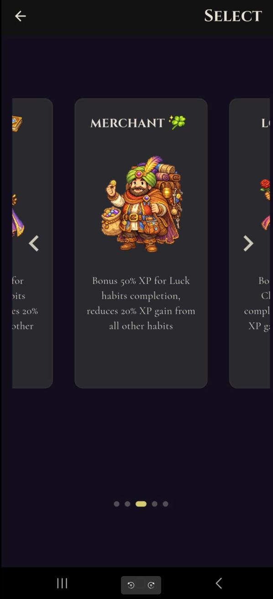
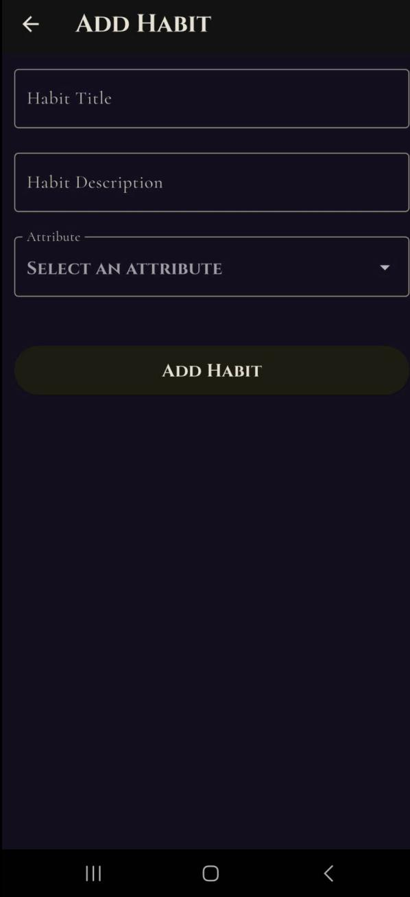
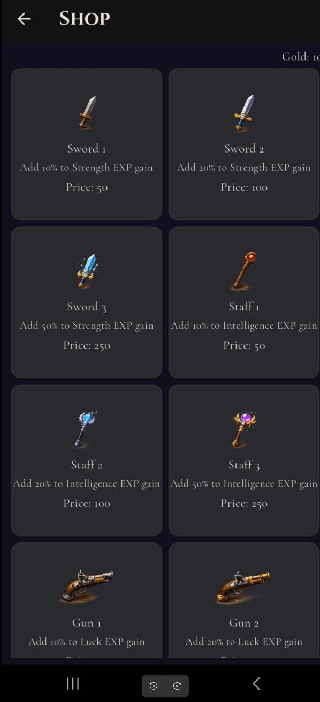

# LifeStats

A gamified self-improvement Flutter app where you build and maintain real-life habits through an RPG-inspired progression system.

---

## 📸 Screenshots

### 🏠 Home Screen

The main hub displaying your character's attributes and level overview.

---

### ⚔️ Class Selection — Image 1

Choose your character class to define your playstyle and attribute gains modifier.

---

### ⚔️ Class Selection — Step 2

Choose your character class to define your playstyle and attribute gains modifier.

---

### ✅ Add Habit

Create and customize new habits to track, earning XP as you complete them.

---

### 🛒 Shop

Spend your earned currency on items to further boost your XP gains.

